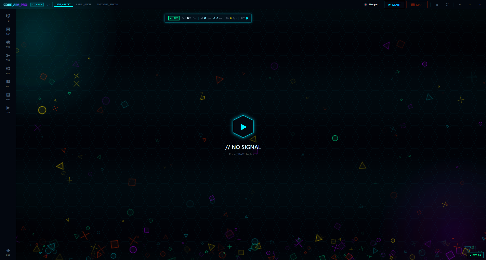
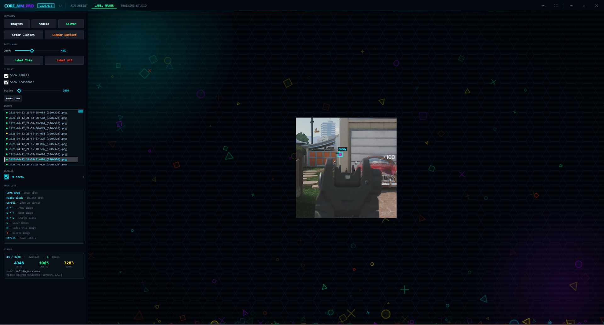
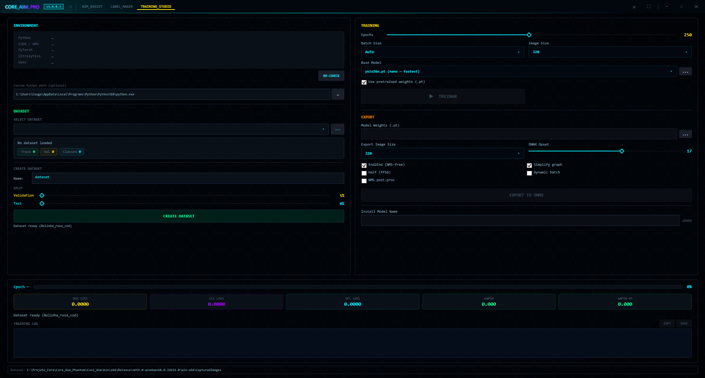

# Core_Aim_pro

**Assistive targeting software built for players with motor, neurological and physical disabilities.**

Core_Aim_pro is an accessibility tool that uses computer vision to help people with reduced mobility, limited fine-motor control or neurological conditions interact with pointing devices more comfortably. It runs on a regular PC and forwards input through certified external hardware, making gaming more accessible for users who would otherwise struggle with precise manual aiming.

---

## 🎮 Supported platforms

Core_Aim_pro works across PC and all major current-gen consoles through a supported hardware device:

- 🖥️ **PC** (Windows 10/11)
- 🎮 **PlayStation 5**
- 🎮 **PlayStation 4**
- 🎮 **Xbox Series X/S**

---

## 🦽 Who is this for?

Core_Aim_pro was designed specifically for people whose physical condition makes precise pointing difficult or exhausting, including:

- **Parkinson's disease** — tremors and involuntary movements
- **Multiple sclerosis (MS)** — loss of fine-motor coordination
- **Cerebral palsy** — spasticity and difficulty controlling muscle groups
- **Muscular dystrophy** — progressive muscle weakness
- **Stroke survivors** — hemiparesis or weakness in one side of the body
- **Spinal cord injuries** — partial quadriplegia or paraplegia
- **Rheumatoid arthritis** — joint pain and stiffness in hands/wrists
- **Amyotrophic lateral sclerosis (ALS)** — progressive loss of muscle control
- **Myasthenia gravis** — muscle weakness and rapid fatigue
- **Essential tremor** — involuntary rhythmic shaking
- **Upper-limb amputation** — partial or full loss of a hand or arm
- **Arthrogryposis** — limited joint range of motion
- **Peripheral neuropathy** — weakness or numbness in the hands
- **Repetitive strain injury (RSI)** — pain that limits prolonged precise input

If you live with any of these conditions, Core_Aim_pro is built to reduce the physical effort required to play and to make gaming sessions less painful and more inclusive.

---

## 📥 Download

Grab the latest build from the [**Releases**](https://github.com/CougarP/Core_Aim_pro/releases/latest) page.

> ⚠️ This repository **does not contain source code**. Only compiled release binaries are distributed.

---

## ✨ Features

### 🎯 Assistive targeting engine
- Real-time computer-vision target tracking
- Smoothing and dead-zone tuning to compensate for tremors and involuntary motion
- Adjustable sensitivity curves so users with limited strength or range of motion can fine-tune the response

### ⚡ Performance
- GPU-accelerated inference via DirectML (NVIDIA, AMD and Intel supported)
- Low-latency pipeline optimized for 60+ FPS on modern hardware
- Configurable capture region to minimize CPU/GPU load on lower-end systems
- Background worker architecture so the UI remains responsive during processing

### 🧠 Model testing
- Built-in ONNX model loader with support for swapping detection models
- Per-model benchmark mode showing average inference time and FPS
- Visual overlay of detections for validation of model accuracy
- Confidence and IoU threshold sliders for live tuning

### 🖥️ System testing
- Automatic hardware detection (GPU vendor, VRAM, CPU, RAM)
- Compatibility check against the minimum and recommended requirements
- Live capture-source diagnostics (DirectX / Desktop / Capture card)
- Real-time performance readout (FPS, frame time, inference time)

---

## 🔌 Supported devices

| Device | Status |
|---|---|
| 🔹 **Titan Two** | ✅ Supported |
| 🔹 **KMBox Net** | ✅ Supported |
| 🔹 **MAKCU (CH9329)** | ✅ Supported |

> **💡 Titan Two users:** Core_Aim_pro talks to the Titan Two **directly**, so you do **not** need GTuner IV, scripts or any companion software running. Just plug the Titan Two in and start the app.

---

## 💻 Minimum requirements

- Windows 10/11 64-bit
- Dedicated GPU (NVIDIA recommended for best inference speed)
- 8 GB RAM
- One of the supported hardware devices listed above

---

## ⚙️ Setup

1. Download the latest `Core_Aim_pro.zip` from [Releases](https://github.com/CougarP/Core_Aim_pro/releases/latest)
2. Extract the folder anywhere on your PC
3. Run `Core_Aim.exe`
4. Select your device inside the application
5. Follow the in-app configuration steps

A full walkthrough, video guides and community help are available on the official Discord server.

---

## 🖼️ Interface

| Aim Assist | Label Maker | Training Studio |
|:---:|:---:|:---:|
|  |  |  |

---

## 💬 Community & Support

Join the official Discord server to access downloads, configuration help, accessibility discussions, bug reports and announcements.

---

## ⚠️ Disclaimer

This software is intended **exclusively for accessibility purposes**, to assist players with motor, neurological or physical disabilities.

- **Do not use this software in online or multiplayer games.** Always respect and follow the license agreement and terms of service of each game.
- The developer of Core_Aim_pro **is not responsible** for bans, suspensions, or any other actions taken against your account due to misuse of this software.
- By downloading and using Core_Aim_pro, you agree to use it responsibly and in full compliance with each game's terms of service.

---

Developed and maintained by **Ricardo**.
